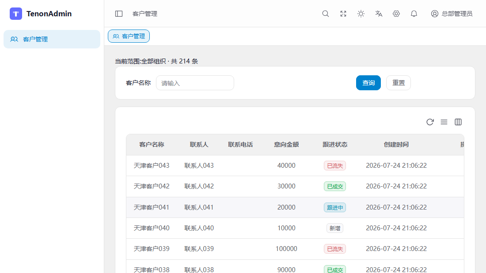
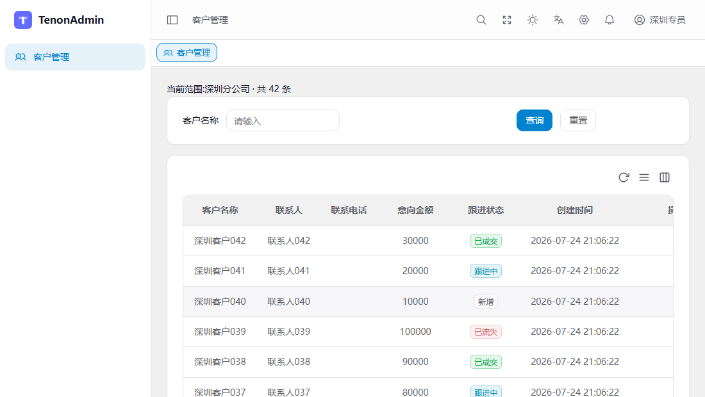

<!-- Keep in sync with README.zh-CN.md (canonical) -->

English | [简体中文](README.zh-CN.md) | [日本語](README.ja.md)

<h1 align="center">Tenon Example</h1>

<p align="center">
  <em>TenonAdmin's public reference app: a real back office that installs the package, ships to production, and you can click through right now.</em>
</p>

<p align="center">
  <a href="https://tenonadmin.52moyu.net/login"><strong>🔗 Live demo</strong></a>&nbsp;&nbsp;·&nbsp;&nbsp;<a href="https://github.com/Tenon-Net/TenonAdmin"><strong>📦 TenonAdmin kernel</strong></a>&nbsp;&nbsp;·&nbsp;&nbsp;<a href="docs/app-ledger.md"><strong>📋 Execution ledger</strong></a>
</p>

---

## 🎨 What is this?

An ordinary business system that happens to have TenonAdmin installed. It is not part of the kernel, and not one line of it is written "for the demo" — this is what your own code looks like after you adopt TenonAdmin.

It exists to skip the "read three days of docs before you know whether it's worth trying" step: there's a deployment you can click, and a repo you can clone and run. CRM is its first business module and more will grow beside it. No reusable kernel capability is developed here; that belongs to the [TenonAdmin](https://github.com/Tenon-Net/TenonAdmin) repo.

## 🔍 The headline: one query, three numbers

Log in to the [live demo](https://tenonadmin.52moyu.net/login) with any account below and open **客户管理 (Customers)**:

| Account | Password | Data scope | Rows | Also gets |
| --- | --- | --- | --- | --- |
| `总部管理员` (HQ admin) | `Trial@123456` | Every organization | 214 | CRM + the whole system console |
| `华南区域经理` (South China manager) | `Trial@123456` | South China region and its branches | 128 | CRM only |
| `深圳专员` (Shenzhen specialist) | `Trial@123456` | Shenzhen branch only | 42 | CRM only |
| `superAdmin` | `TenonExample@675b52d8` | Unrestricted | 214 | Every module, every button |





Three numbers, one endpoint, one piece of frontend code — and the `CustomerService` behind it doesn't contain a single organization filter. The kernel attaches that filter outside your business code entirely. [One query, three numbers](docs/showcase-multi-org-data-scope.md) (in Chinese) walks through where it attaches, and why that's worth far more than saving a few lines.

The first three accounts hold read-only permissions on the customer endpoints, so the add/edit/delete buttons never render at all. HQ admin additionally holds the kernel's full system-management menu through ordinary role grants, not a super-admin bypass. The login page has one-click buttons for all four, so nobody has to type a password.

## 🚀 Running it

You need the .NET 10 SDK, plus Node.js 22 if you want the frontend.

### Docker

```bash
docker compose up -d --build
```

Brings up MySQL, Redis, the backend, and a Caddy-served build of the frontend. The frontend listens on `TENON_WEB_PORT` (default `8090`) and reverse-proxies `/api` and `/health*` to the backend. Override secrets and ports in a `.env` file next to `docker-compose.yml` (`TENON_DB_PASSWORD`, `TENON_JWT_SECRET`, `TENON_ADMIN_PASSWORD`, `TENON_API_PORT`, `TENON_WEB_PORT`) and never commit the real values.

### Local development

```powershell
dotnet restore
dotnet build -c Release
dotnet run
```

Defaults to SQLite, so there's no database to install first. The first startup creates the schema, loads seed data, and prints a random super-admin password to the console. Once it's up, `/health`, `/health/ready`, and `/openapi/v1.json` are all reachable.

Don't delete `Properties/launchSettings.json`. It pins `ASPNETCORE_ENVIRONMENT=Development`; without it the host resolves to `Production`, where CodeFirst schema creation is disabled by design, and startup fails outright on the missing seed tables. The full story is in the [v0.3.2 upgrade record](docs/v0.3.2-upgrade.md).

Run the frontend in a separate terminal, and don't make it compete with the backend's verification processes for memory:

```powershell
Set-Location web
npm install
npm run gen:api
npm run dev
```

The dev server proxies the API and the OpenAPI contract to `http://localhost:5100`. `npm run typecheck` and `npm run lint` are the two to run before committing.

## 🔒 Demo mode and import experience

Customer import is **dry-run** by default (`CrmDemo:ImportDryRun=true`): trial accounts can complete upload / preview / validate / commit, and the commit result is clearly marked as not written to the database. Export uses the same query as the list and still respects data scope.

The public deploy additionally turns on `CrmDemo:ReadOnly` (`DemoReadOnlyFilter`): every non-GET except login and import returns `403` / `41002`. Menus, buttons and forms still render and still respond — they just can't reach the database. **The four passwords above are public; what protects the live demo is this gate, not the passwords.** Don't substitute the kernel's `TenonAdmin:DemoMode` for it: that one has no allowlist and would block the import POSTs too.

Locally `ReadOnly` defaults to `false`, so all four accounts really can add, edit and delete; set `ImportDryRun` to `false` as well and import writes for real.

## 📌 Version alignment

Currently pinned to the stable `0.6.0` release: `TenonAdmin` / `TenonAdmin.Excel` / `TenonAdmin.Templates` `0.6.0` on NuGet, source tag `v0.6.0`; frontend from `Tenon-Net/TenonAdmin/web#v0.6.0`. Upgrade notes: [v0.6.0 upgrade record](docs/v0.6.0-upgrade.md).

The version in `tenon-example.csproj` must match that paragraph exactly. Every kernel release gets bumped and re-verified here — this repo doubles as the kernel's permanent integration canary, and a canary running an old version isn't in the cage.

Reproducing the same artifacts from an empty directory:

```powershell
dotnet new install TenonAdmin.Templates@0.6.0
dotnet new tenon-app --output tenon-example
Set-Location tenon-example
npx degit Tenon-Net/TenonAdmin/web#v0.6.0 web
```

Then follow the two sections above. Staged implementation records, verification evidence, and the list of things that bit us as a consumer all live in `docs/`.
